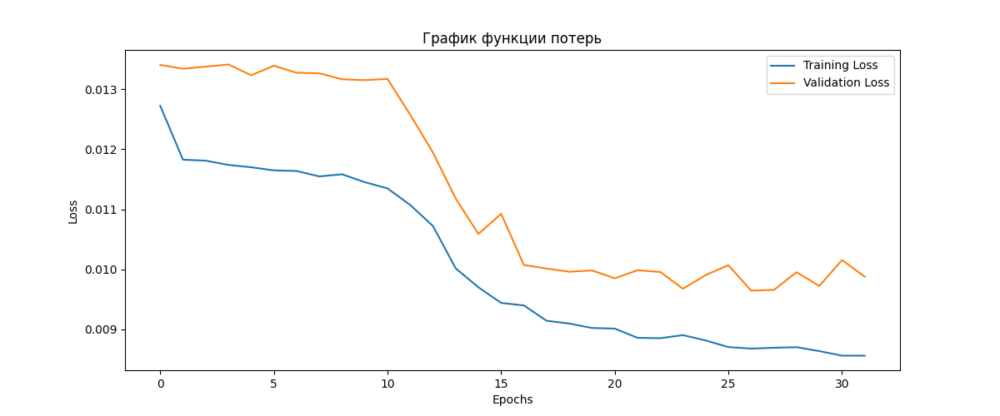
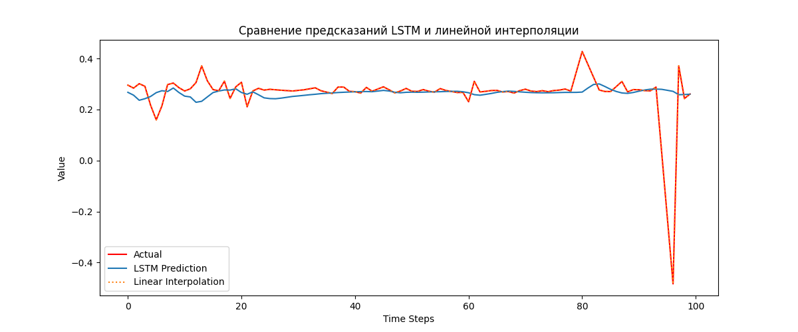

# Лабораторная работа №2 — восстановление показаний датчиков

[Вернуться к общему README](../README.md) · [Открыть блокнот](Lab2.ipynb)

## Цель работы

Восстановить пропущенные значения в показаниях акселерометра и гироскопа из Human Activity Recognition Dataset с помощью LSTM.

## Ход работы

Из набора данных выбираются шесть временных признаков ускорения и угловой скорости. К ним добавляется гауссов шум, после чего случайно удаляется около 10% значений. Пропуски заполняются линейной интерполяцией, а LSTM учится предсказывать следующую точку по скользящему окну.

Качество восстановления оценивается с помощью MSE, MAE и R².

## Результаты без шума

## Результаты с шумом

## Запуск

Установите `tensorflow`, `numpy`, `pandas`, `matplotlib` и `scikit-learn`. Исходный CSV находится в `data/test.csv`; если блокнот запускается из `Lab2`, укажите в ячейке загрузки путь `data/test.csv`.
