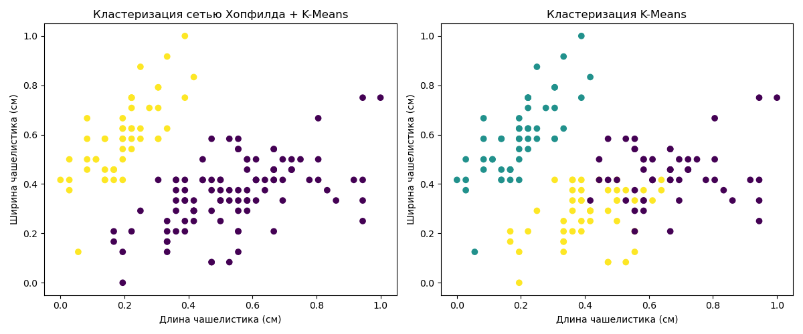

# Лабораторная работа №3 — кластеризация Iris

[Вернуться к общему README](../README.md) · [Открыть блокнот](Lab3.ipynb)

## Цель работы

Сравнить кластеризацию набора Iris с использованием сети Хопфилда и алгоритма K-Means.

## Ход работы

Признаки масштабируются с помощью `MinMaxScaler` и дискретизируются для сети Хопфилда. После получения устойчивых состояний K-Means разделяет объекты на три кластера. Результат сравнивается с прямым применением K-Means к масштабированным признакам.

Для оценки используются Adjusted Rand Score и Silhouette Score.

## Визуализация

На графике показана двумерная проекция результатов обоих методов.

## Запуск

Установите `numpy`, `pandas`, `matplotlib` и `scikit-learn`. Поместите `Iris.csv` в каталог `Lab3/data/` и запускайте блокнот из папки `Lab3`.
