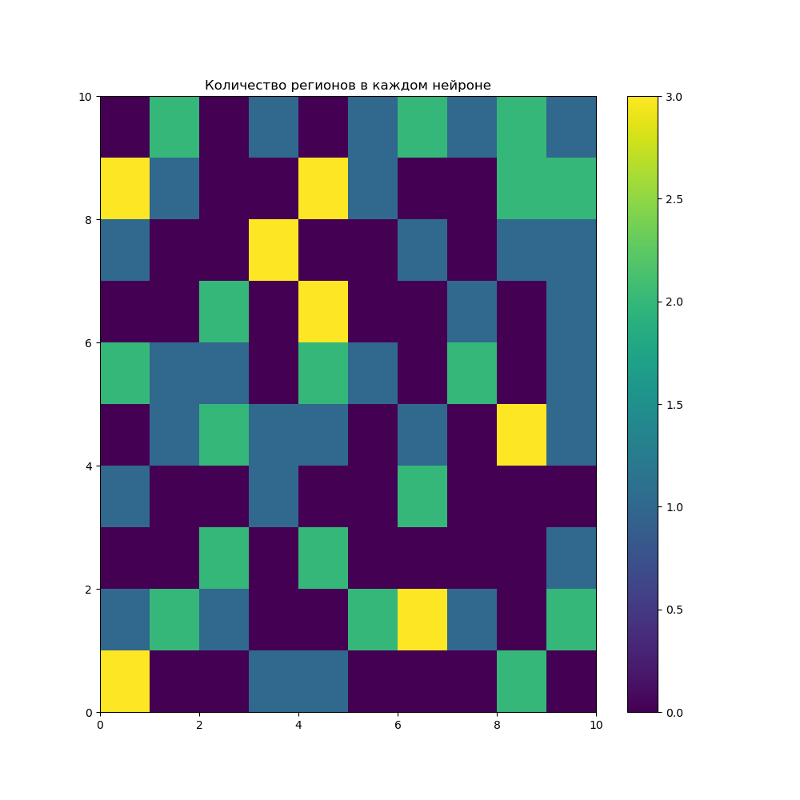
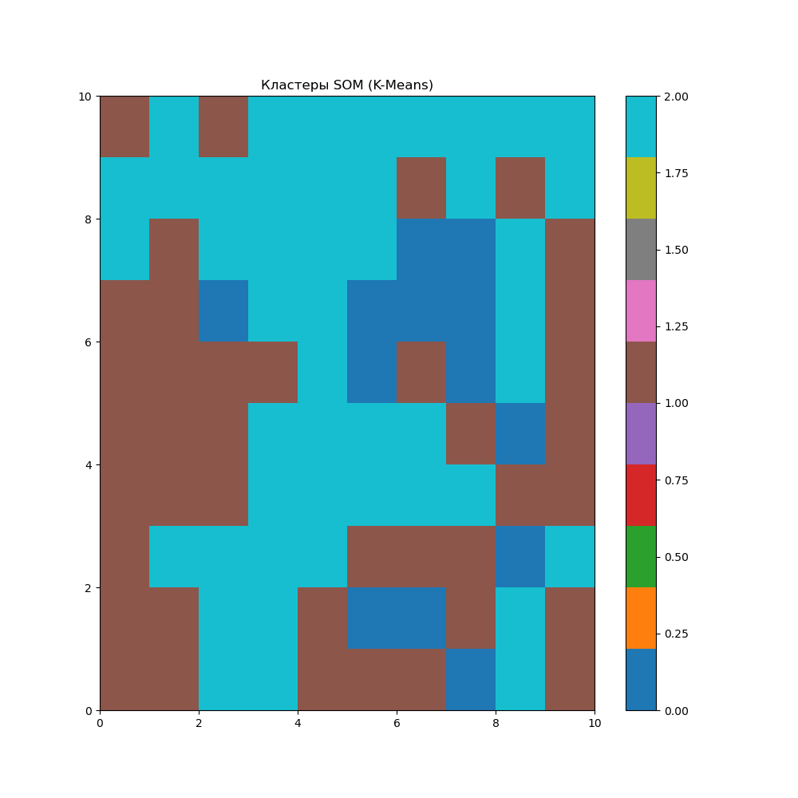
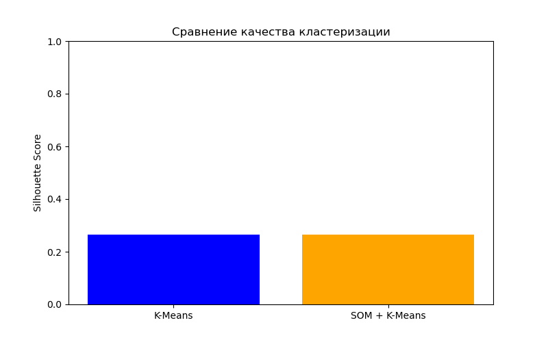

# Лабораторная работа №4 — карта Кохонена

[Вернуться к общему README](../README.md) · [Открыть блокнот](Lab4.ipynb)

## Цель работы

Сгруппировать регионы России по показателям потребления алкогольных напитков с помощью самоорганизующейся карты Кохонена и сравнить результат с K-Means.

## Ход работы

Данные очищаются, усредняются по регионам и масштабируются. Карта MiniSom обучается на показателях потребления вина, пива, водки, шампанского и бренди. Затем веса нейронов группируются с помощью K-Means.

## U-Matrix

## Размещение регионов на карте

## Кластеры карты

## Прямой K-Means

## Сравнение качества

## Запуск

Установите `numpy`, `pandas`, `matplotlib`, `scikit-learn` и `minisom`. Файл `russia_alcohol.csv` должен находиться в `Lab4/data/`. Запускайте блокнот из каталога `Lab4`.
