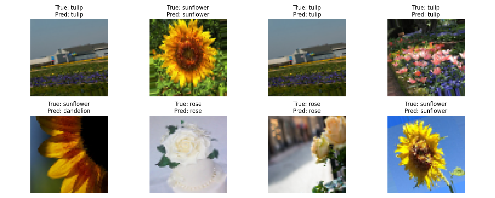

# Лабораторная работа №5 — классификация цветов

[Вернуться к общему README](../README.md) · [Открыть блокнот](ЛР5_Машинное_обучение_Никитин.ipynb)

## Цель работы

Обучить свёрточную нейронную сеть распознавать пять видов цветов: ромашку, одуванчик, розу, подсолнух и тюльпан.

## Модель

Изображения приводятся к размеру 64 × 64 пикселя. Во время обучения применяются повороты, масштабирование и горизонтальное отражение. Архитектура содержит три свёрточных блока с Batch Normalization и Max Pooling, затем полносвязные слои с Dropout и выходной слой `softmax`.

## Графики обучения

## Примеры предсказаний

## Запуск

Установите `tensorflow`, `numpy`, `matplotlib` и `scikit-learn`. Данные должны находиться в каталогах `flowers/train/<название класса>/`. Блокнот также может распаковать подготовленный `dataset.zip` в папку `flowers`.
