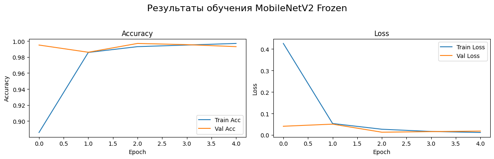
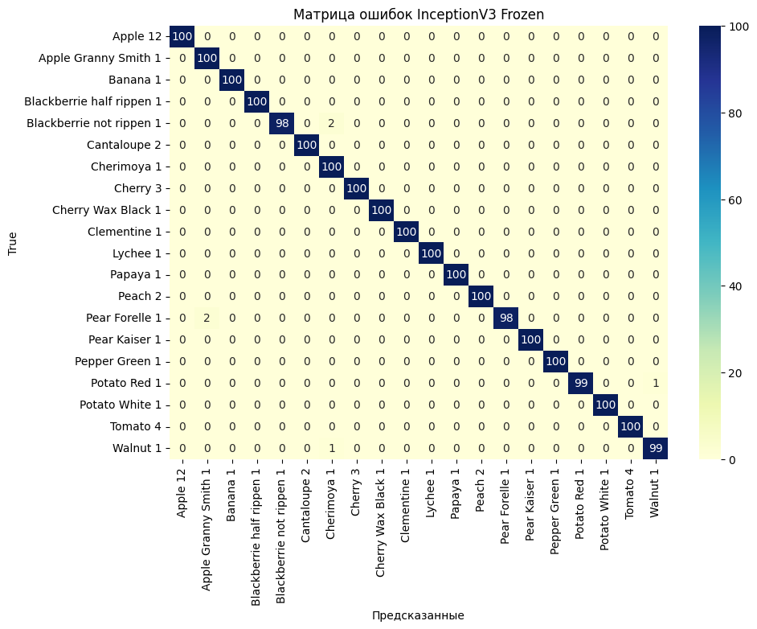
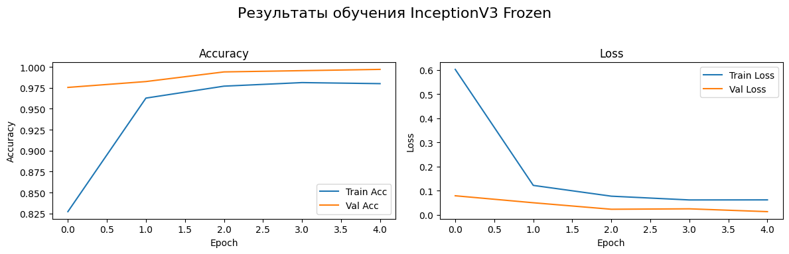
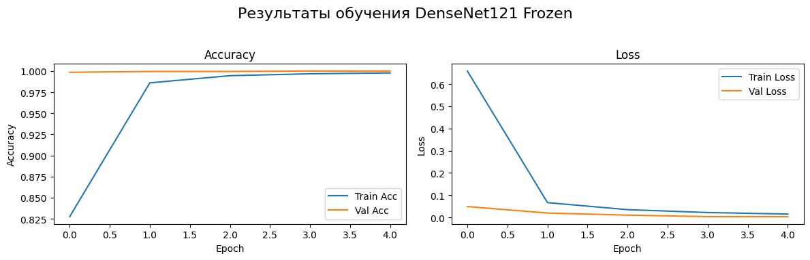
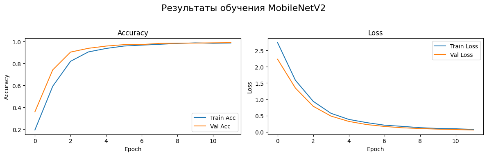
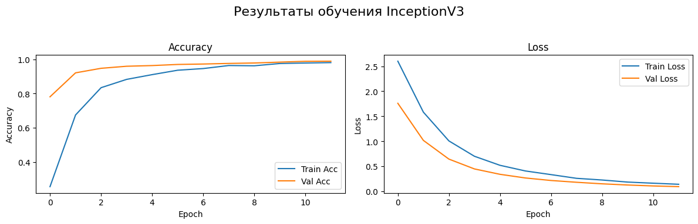
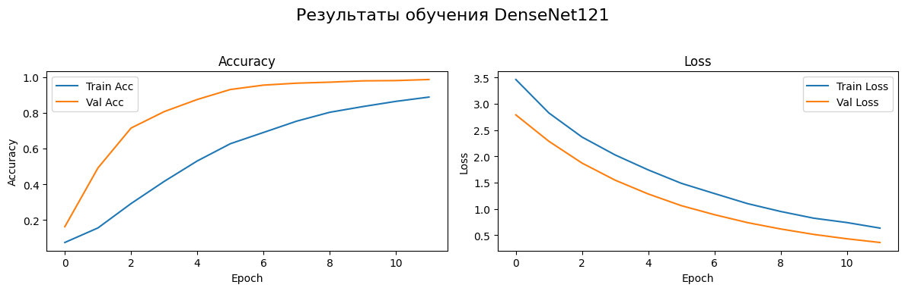

# Лабораторная работа №6 — перенос обучения на Fruits 360

[Вернуться к общему README](../README.md) · [Открыть блокнот](Lab6.ipynb)

## Цель работы

Сравнить MobileNetV2, InceptionV3 и DenseNet121 при классификации выбранных классов Fruits 360.

Каждая архитектура исследуется в двух режимах: с полностью замороженной предобученной базой и с дообучением последних 20 слоёв. Качество оценивается по accuracy, precision, recall, F1-score и матрице ошибок.

## Модели с замороженной базой

### MobileNetV2

### InceptionV3

### DenseNet121

## Модели после частичного дообучения

### MobileNetV2

### InceptionV3

### DenseNet121

## Запуск

Блокнот подготовлен для Google Colab и загружает Fruits 360 через Kaggle API. Потребуются `tensorflow`, `numpy`, `matplotlib`, `seaborn`, `scikit-learn` и `kaggle`.

Перед запуском добавьте свой `kaggle.json`, проверьте путь к распакованному набору данных и создайте каталог `diagrams/` для сохраняемых графиков. Не публикуйте `kaggle.json`, поскольку он содержит данные доступа к Kaggle.
