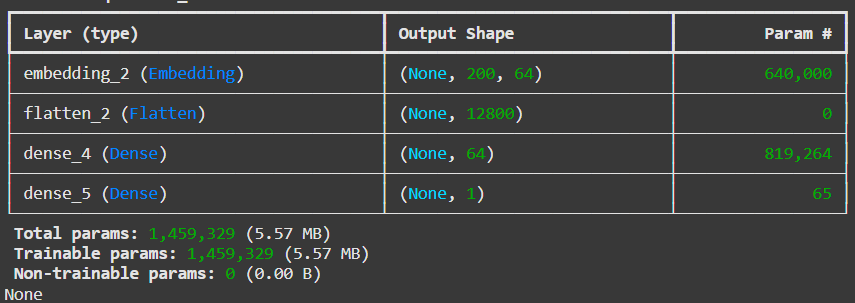
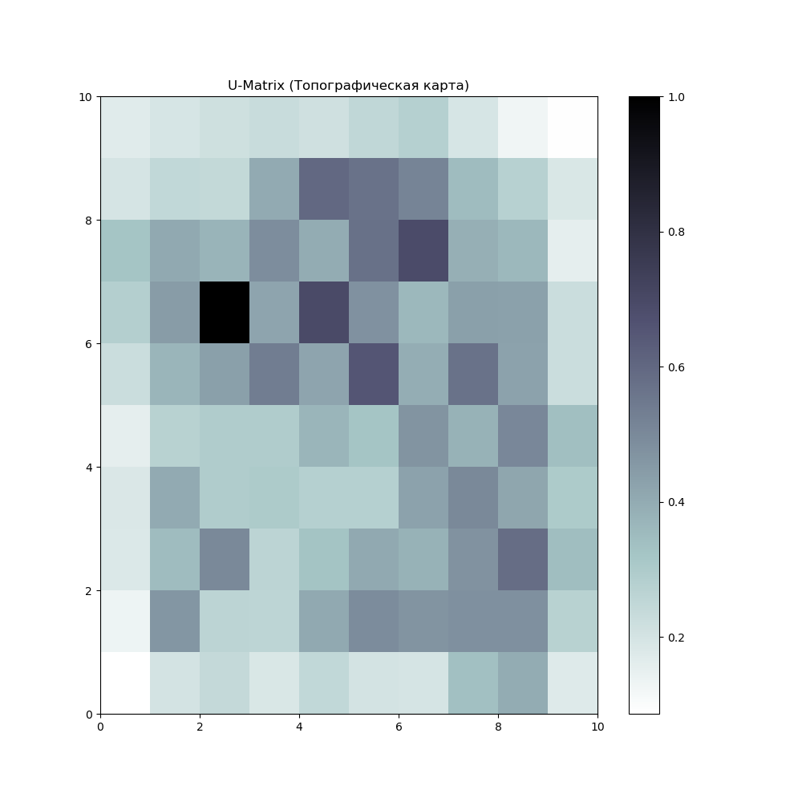

# Лабораторные работы по машинному обучению

Репозиторий содержит шесть лабораторных работ по нейронным сетям, кластеризации и обработке данных.

Автор: Никитин Дмитрий, группа 4217.

## Содержание

| Работа | Тема | Основные методы |
| --- | --- | --- |
| [Лабораторная №1](Lab1/README.md) | Классификация отзывов IMDb | Embedding, полносвязная сеть |
| [Лабораторная №2](Lab2/README.md) | Восстановление показаний датчиков | LSTM, линейная интерполяция |
| [Лабораторная №3](Lab3/README.md) | Кластеризация Iris | Сеть Хопфилда, K-Means |
| [Лабораторная №4](Lab4/README.md) | Кластеризация регионов России | Карта Кохонена, K-Means |
| [Лабораторная №5](Lab5/README.md) | Классификация изображений цветов | Свёрточная нейронная сеть |
| [Лабораторная №6](Lab6/README.md) | Классификация Fruits 360 | MobileNetV2, InceptionV3, DenseNet121 |

## Галерея работ

### Лабораторная №1 — архитектура нейронной сети

### Лабораторная №2 — восстановление сигнала

### Лабораторная №3 — кластеризация Iris

### Лабораторная №4 — самоорганизующаяся карта

### Лабораторная №5 — распознавание цветов

### Лабораторная №6 — перенос обучения

## Запуск

1. Установите Jupyter Notebook или JupyterLab.
2. Установите библиотеки, необходимые для выбранной лабораторной. В работах используются `numpy`, `pandas`, `matplotlib`, `scikit-learn` и `tensorflow`; для лабораторной №4 также нужен `minisom`, для №6 — `seaborn` и `kaggle`.
3. Подготовьте датасет по инструкции в README соответствующей работы.
4. Откройте блокнот и последовательно выполните его ячейки.

Датасеты занимают много места и должны храниться локально. Полученные графики, блокноты и отчёты находятся в репозитории.
